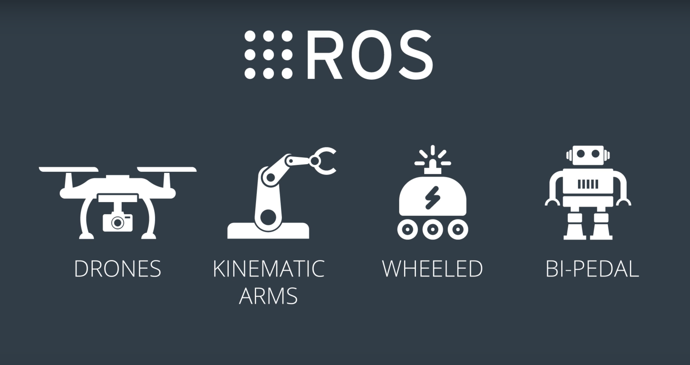
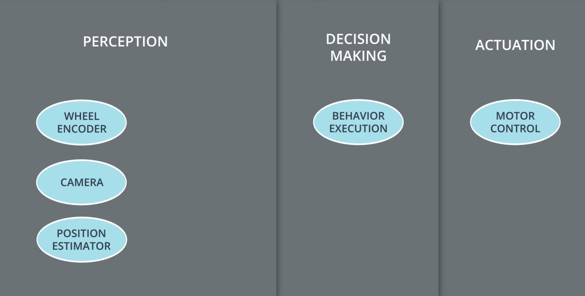
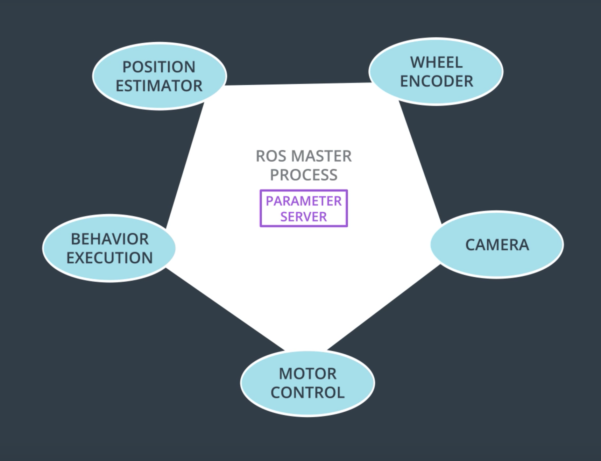

## Robotic Structure
机器人几乎拥有者相同的架构。
ROS 提供了强劲的通信系统，允许不同组件互相沟通。

机器人从构造上来说，都可以执行三个大致步骤：感知、决策与驱动。
## Node
ROS 管理这三个复杂的步骤时，将每个分解为很多更小的单元，我们称之为 Node。

通常，系统上的每个 Node 负责机器人功能总体的一个特定的小部分。
例如，系统中可能每个传感器都有相应 Node
此外还有 Node 对应位置估算，行为执行和马达控制。
## Master
在 ROS 有一个主 Node 叫 Master，它相当于所有节点的管理器。

Master 维护着系统上所有 Node 的注册表。它允许每个 Node 发现系统里的其他 Node，并与其建立通信线路。

除了允许 Node 相互发现和通信外，Master 还负责作为参数服务器。
如其名称所示，参数服务器通常用于存储参数和配置值，并在运行 Node 中共享。
## Topic Publisher/Subscriber
Node 也可以通过在 Topic 相互传递信息实现相互共享数据。
Topic 可以看做 Node 之间传递消息的管道。要在一个 Topic 上发送消息，Node 必须把消息 Publish 到该 Topic。
同样地，要从一个 Topic 接收消息，Node 必须 Subscribe 该主题。

上图说明了我们之前介绍过的 Topic，Publisher 和 Subscriber。
箭头代表从 Publisher 到 Subscriber 的消息流。
值得注意的是 每个 Node 都可能同时 Publish 并 Subscribe 不同的 Topics。

所以 Node 网络通过 Topic 连接我们称之为 Pub/Sub 架构。
## Message

Topic 上的 Message 有许多类型。
预定义的 Message 类型，可直接使用有物理数量通信所需的 Message 类型，如位置、速度、加速度、旋转和持续时间。

还有传感器度数通信所需的 Message，如激光扫描、图像、点云、惯性测量值等等。

完整的 ROS 安装中可用的 Message 类型数量实际上非常庞大。
但是，即便有这么多有用的 Message 类型，有时候我们仍需要自己定义新的类型。
