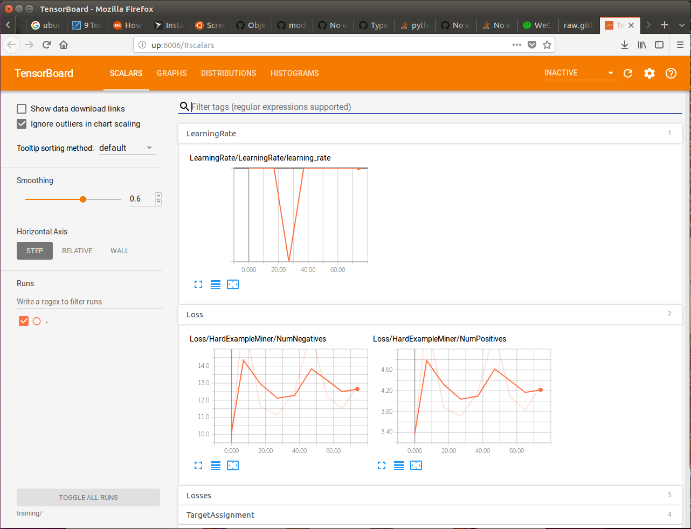
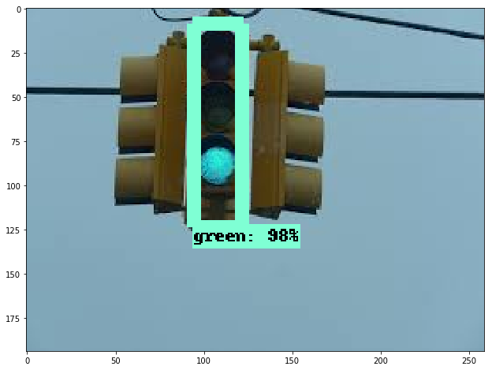
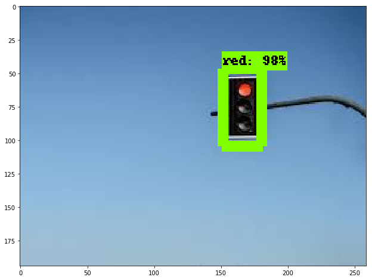
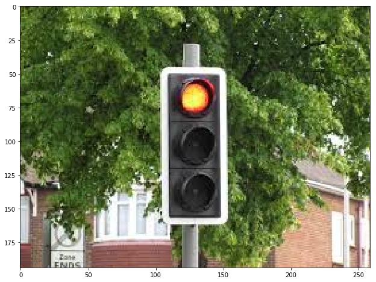

## TensorFlow API 配置
首先在终端下载 TensorFlow 官网的 API repo。
```bash
git clone https://github.com/tensorflow/models/
```
Tensorflow 目标检测 Demo [地址](https://github.com/tensorflow/models/tree/master/research/object_detection)。
根据 [配置教程](https://github.com/tensorflow/models/blob/master/research/object_detection/g3doc/installation.md)，跑通 TensorFlow 目标检测的 notebook。
## 采集训练需要用的真实图片。
共有三种选择：
1. 可以上车采集真实的图片，红灯，黄灯，绿灯，还有随机图片。（如果选择这个选项，可以试着进入 [配置相关文件](./config_doc.md)，找到`mindvision`相关内容，进行配置）
2. 也可以网络抓取训练图片。
3. 可以下载已有的数据集。
## 下载打标签的 API
进入 [LabelImg](https://github.com/tzutalin/labelImg)，学习使用此 API，并按照流程将采集到的图片分类，并做好方框标签。（比较耗时）

安装流程：
Python3 on Ubuntu16.04:
```bash
$ git clone https://github.com/tzutalin/labelImg
$ sudo apt-get install pyqt5-dev-tools
$ sudo pip3 install lxml
$ make qt5py3
$ python3 labelImg.py
```
之后你会打开一个 GUI 程序，并按照 github 说明进行图片的打标签工作。

最终会导出图片对应的 `.xml` 文件。

之后建立文件夹树，
```
-object_detection/
 -images/
  -train/
  -test/
```
将图片以及对应的标签`.xml`文件首先放在`img/`文件夹下，并且以推荐比例`7/3`或者`8/2`分别 **复制** 在文件夹`train/`和`test/`中。

## 转换数据格式
从 [这里](https://github.com/datitran/raccoon_dataset) 下载`xml_to_csv.py`与`generate_tfrecord.py`文件，调整相应的代码将数据转换为 TensorFlow 所要求的文件。

将以上两个文件放入到`object_detection/`中，并在该文件夹下新建`data/`和`training/`文件夹。现在结构如下所示。
```
-object_detection/
 -data/
 -images/
  -train/
   -trainingimages.jpg
   -trainingimages.xml
  -test/
   -testingimages.jpg
   -testingimages.xml
 -training
 -xml_to_csv.py
 -generate_tfrecord.py
```
- 修改 `xml_to_csv.py`
    ```python
    def main():
        image_path = os.path.join(os.getcwd(), 'annotations')
        xml_df = xml_to_csv(image_path)
        xml_df.to_csv('raccoon_labels.csv', index=None)
        print('Successfully converted xml to csv.')
    ```
    改为：
    
    ```python
    def main():
        for directory in ['train','test']:
            image_path = os.path.join(os.getcwd(), 'images/{}'.format(directory))
            xml_df = xml_to_csv(image_path)
            xml_df.to_csv('data/{}_labels.csv'.format(directory), index=None)
            print('Successfully converted xml to csv.')
    ```
    在终端输入：
    ```bash
    $ pip3 install pandas
    $ python3 xml_to_csv.py
    ```
    会显示两行的`Successfully converted xml to csv`
    并且在文件夹`data/`下会看到两个`.csv`文件。
- 修改 `generate_tfrecord.py`
    - 原代码：
    ```
      # Create train data:
      python generate_tfrecord.py --csv_input=data/train_labels.csv  --output_path=train.record
      # Create test data:
      python generate_tfrecord.py --csv_input=data/test_labels.csv  --output_path=test.record
    ```
    改为：
    ```   
      # Create train data:
      python3 generate_tfrecord.py --csv_input=data/train_labels.csv  --output_path=data/train.record
      # Create test data:
      python3 generate_tfrecord.py --csv_input=data/test_labels.csv  --output_path=data/test.record
    ```
    
    - 原代码
    ```python
    # TO-DO replace this with label map
    def class_text_to_int(row_label):
        if row_label == 'raccoon':
            return 1
        else:
            None
    ```
    改为：
    ```python
    
    # TO-DO replace this with label map
    def class_text_to_int(row_label):
        if row_label == 'red':
            return 1
        elif row_label == 'yellow':
            return 2
        elif row_label == 'green':
            return 3
        else:
            None
    ```
    通过运行脚本将数据转换为 TF_records 文件。
    ```bash
    $ python3 generate_tfrecord.py --csv_input=data/train_labels.csv  --output_path=data/train.record
    $ python3 generate_tfrecord.py --csv_input=data/test_labels.csv  --output_path=data/test.record
    ```
    若出现错误，请回到刚才`git clone`下载得到的文件夹下`models/research/`路径下，打开终端执行：
    ```bash
    $ python3 setup.py install
    ```
    回到`object_detection/`目录下重新执行上述`python3`命令。
    这样，在文件夹`data/`下又会增加两个`.record`文件。

## 选择 TensorFlow 模型
从 TensorFlow 模型库中找到合适的 [模型](https://github.com/tensorflow/models/blob/master/research/object_detection/g3doc/detection_model_zoo.md)，并找到对应的 [config 文件](https://github.com/tensorflow/models/tree/master/research/object_detection/samples/configs) 下载。

将 [config 文件](https://github.com/tensorflow/models/tree/master/research/object_detection/samples/configs) ，并且解压 [模型](https://github.com/tensorflow/models/blob/master/research/object_detection/g3doc/detection_model_zoo.md) 文件


- 下面以下载的`ssd_inception_v2_coco_2018_01_28.tar.gz`和`ssd_inception_v2_coco.config`为例。
    - 首先将`ssd_inception_v2_coco_2018_01_28.tar.gz`解压放到`object_detection`路径下。
    - 修改`ssd_inception_v2_coco.config`原代码：
        ```
        ssd {
          num_classes: 90
        box_coder {
          faster_rcnn_box_coder {
            y_scale: 10.0
            x_scale: 10.0
            height_scale: 5.0
            width_scale: 5.0
          }
        ```
        改为：
        ```
        ssd {
          num_classes: 3
        box_coder {
          faster_rcnn_box_coder {
            y_scale: 10.0
            x_scale: 10.0
            height_scale: 5.0
            width_scale: 5.0
          }
        ```
    
    - 原代码：
        ```
        fine_tune_checkpoint: "/PATH_TO_BE_CONFIGURED/model.ckpt"
        ```
        改为：
        
        ```
        fine_tune_checkpoint: "ssd_inception_v2_coco_2018_01_28/model.ckpt"
        ```

    - 原代码：
    
        ```
        train_input_reader: {
        tf_record_input_reader {
        input_path: "PATH_TO_BE_CONFIGURED/mscoco_train.record-?????-of-00100"
        }
        label_map_path: "PATH_TO_BE_CONFIGURED/mscoco_label_map.pbtxt"
        }
        ```
        改为：
        ```
        train_input_reader: {
        tf_record_input_reader {
        input_path: "data/train.record"
        }
        label_map_path: "data/object-detection.pbtxt"
        }
        ```
    - 原代码：
    
        ```
        eval_input_reader: {
        tf_record_input_reader {
        input_path: "PATH_TO_BE_CONFIGURED/mscoco_train.record-?????-of-00100"
        }
        label_map_path: "PATH_TO_BE_CONFIGURED/mscoco_label_map.pbtxt"
        }
        ```
        改为：
               
        ```
        eval_input_reader: {
        tf_record_input_reader {
        input_path: "data/test.record"
        }
        label_map_path: "data/object-detection.pbtxt"
        }
        ```
    将改后的`.config`放在`data/`和`training/`文件夹中。

- 在`/training`的文件夹中，加入`object-detection.pbtxt`文件：
```
item {
  id: 1
  name: 'red'
}
item {
  id: 2
  name: 'yellow'
}
item {
  id: 3
  name: 'green'
}
```
## 训练
目前，整个训练的文件树模型为：
```
-object_detection/
 +ssd_inception_v2_coco_2018_01_28/
 -data/
  -train_labels.csv
  -test_labels.csv
  -train.record
  -test.record
  -object-detection.pbtxt
 -images/
  -train/
   -trainingimages.jpg
   -trainingimages.xml
  -test/
   -testingimages.jpg
   -testingimages.xml
 -training
  -object-detection.pbtxt
  -ssd_inception_v2_coco.config
 -xml_to_csv.py
 -generate_tfrecord.py
```

将`object_detection/`下所有文件复制粘贴在`models/research/object_detection/legacy/`目录下
在`legacy/`目录下打开终端：

```bash
$ python3 train.py --logtostderr --train_dir=training/ --pipeline_config_path=training/ssd_inception_v2_coco.config
```
若执行成功，将会看到：
```
INFO:tensorflow:global step 11788: loss = 0.6717 (0.398 sec/step)
INFO:tensorflow:global step 11789: loss = 0.5310 (0.436 sec/step)
INFO:tensorflow:global step 11790: loss = 0.6614 (0.405 sec/step)
INFO:tensorflow:global step 11791: loss = 0.7758 (0.460 sec/step)
INFO:tensorflow:global step 11792: loss = 0.7164 (0.378 sec/step)
INFO:tensorflow:global step 11793: loss = 0.8096 (0.393 sec/step)
```
若执行中出现错误，`no module named 'nets'`，转换地址打开终端，执行：
在`tensorflow/models/release`目录终端下执行：

```bash
$ # From tensorflow/models/
export PYTHONPATH=$PYTHONPATH:`pwd`:`pwd`/slim
# switch back to object_detection after this and re run the above command
```

之后在`legacy/`，打开终端：
```
$ tensorboard --logdir='training/'
```
在浏览器中地址栏输入 `http://<host_name>:6006 `，你讲会看到实时的训练过程。比如下图所示：


## 输出
将自己新建的`/object_detection`中的内容放入到 [官网](https://github.com/tensorflow/models/tree/master/research/object_detection) 中进行合并。可以找到其中`export_inference_graph.py`的文件。
- 原代码
```
python export_inference_graph \
    --input_type image_tensor \
    --pipeline_config_path path/to/ssd_inception_v2.config \
    --trained_checkpoint_prefix path/to/model.ckpt \
    --output_directory path/to/exported_model_directory
```
  调整并在该路径终端下执行：
```
python3 export_inference_graph.py \
    --input_type image_tensor \
    --pipeline_config_path legacy/training/ssd_inception_v2_coco.config \
    --trained_checkpoint_prefix legacy/training/model.ckpt-<latest_number> \
    --output_directory pix
```

```
    
同样，若执行中出现错误，`no module named 'nets'`，转换地址打开终端，执行：
在`tensorflow/models/release`目录终端下执行：

```bash
$ # From tensorflow/models/
export PYTHONPATH=$PYTHONPATH:`pwd`:`pwd`/slim
# switch back to object_detection after this and re run the above command
```
执行后回到 `tensorflow/models/tree/master/research/object_detection/`目录下，重新执行上述程序。
若执行成功会有 `pix/` 的文件夹，其中，`frozen_inference_graph.pb`很重要。

## 测试
利用官网 [notebook](https://github.com/tensorflow/models/blob/master/research/object_detection/object_detection_tutorial.ipynb) 修改相关测试图片的代码做一遍测试。

首先将一些红绿灯的测试图片放入`models/research/object_detection/test_images/`下，修改文件名为`image<number>.jpg`。

修改 `models/research/object_detection/object_detection_tutorial.ipynb`部分代码。
- 原代码
```notebook
# What model to download.
MODEL_NAME = 'ssd_mobilenet_v1_coco_2017_11_17'
MODEL_FILE = MODEL_NAME + '.tar.gz'
DOWNLOAD_BASE = 'http://download.tensorflow.org/models/object_detection/'

# Path to frozen detection graph. This is the actual model that is used for the object detection.
PATH_TO_FROZEN_GRAPH = MODEL_NAME + '/frozen_inference_graph.pb'

# List of the strings that is used to add correct label for each box.
PATH_TO_LABELS = os.path.join('data', 'mscoco_label_map.pbtxt')

NUM_CLASSES = 90
```
改为：
```
# What model to download.
MODEL_NAME = 'pix'

# Path to frozen detection graph. This is the actual model that is used for the object detection.
PATH_TO_FROZEN_GRAPH = MODEL_NAME + '/frozen_inference_graph.pb'

# List of the strings that is used to add correct label for each box.
PATH_TO_LABELS = os.path.join('legacy/training', 'object-detection.pbtxt')

NUM_CLASSES = 3
```
删除`Download Model`模块。

在`Detection`模块中，修改测试图片的编号，如`range(3, 6)`。最后运行整个程序。




若测试结果很理想，就可以进行下一步，[配置相关文件](./config_doc.md)。


感谢 [Sentdex](https://pythonprogramming.net/introduction-use-tensorflow-object-detection-api-tutorial/) 提供的教学，详细资讯请参考 [TensorFlow 官方教程](https://github.com/tensorflow/models/tree/master/research/object_detection)。
